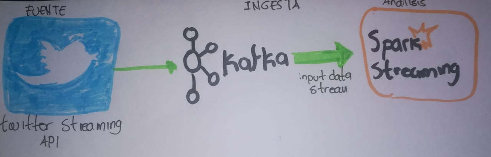

# PROYECTO 3 - BIGDATA
## Curso ST0263 Tópicos Especiales en Telematica
## Universidad EAFIT
## 2018-2

## Estudiantes:
* David Felipe Lemus Giraldo
* Juan Camilo Rodriguez Montoya

## a. Problema a resolver ##

Tanto instragram como snapchat son redes sociales y aplicaciones moviles, la primera fue lanzada en el 2010 y la segunda en el 2011.
En lo corrido de los dos ultimos años estas han presentando una rivalidad fuerte debido al lanzamiento de instagram storis lo que ha ocasionado que snapchat vea peligrar su crecimiento.
Desde las funcionalidades, las dos presentan similitudes, probablemente instagram pudo haber adaptado algunas de las caracteristicas de snapchat en su app, a la fecha instagram cuenta con mas de 200 millones de usuarios frente a snapchat que cuenta con 160 millones, se preveé que las estadisticas de instagram seguin mejorando a comparación de snapchat.

Con el uso cotidiano de las rede sociales como medio para compartir momentos ya sean personales, empresariales, sociales, entre otros, los usuarios siempre tienden a tener una cuenta preferida ya sea por su usabilidad, numero de amigos, funcionalidades, etc. Esto hace que de forma publica se hagan comentarios acerca de la app de su preferencia o de mayor disgusto de forma publica, es asi como el objetivo de este demo es realiar un breve analisis sobre cual es la aplicacion de preferencia a partir de las opiniones y sentimientos expresados en twitter acerca de estas.

Por que sentimientos?

Un sentimiento es la manifestacion de una emoción, una opinion o de las actitudes que se expresen en el momento respecto a algo, es por esto que el problema a resolver será la identificación y categorización de los sentimientos expresados de los usuarios de twitter a partir de los tweets y comentarios que estos realizan.

## b. Arquitectura preliminar de datos ##

## c. Fuentes y naturaleza de los datos + tecnologías a utilizar ##

La fuente de datos sera *Twitter* y la tecnologia a utilizar sera *Twitter Streaming API*.
La naturaleza de los datos es de indole cualitativa ya que estaremos analizando sentimientos y estos son considerados cualidades o actitudes donde es imposible darle una medida, pero podemos hablar de una naturaleza cuantitativa al contar cuantas veces se es expresado o mencionado en twitter en un momento espeficifico

## d. Sistema de ingesta de datos + tecnologías a utilizar ##

Para la ingesta de datos se utilizar *Flume*, esta es usada para construir canales de datos en tiempo real y aplicaciones de transmisión ademas que es escalable y tolerante a fallos.

Ademas se utilizará *Spark Streming* el cual es un componente que permite la transmisión envivo de datos

## e. Almacenamiento de los datos + tecnologías a utilizar ##

En este caso se utlizara *RDD* para la representación de los datos haciendo uso de *Spark*

## f. Análisis de datos + tecnologías a utilizar ##

En analisis de datos se hara a partir de *Apache Spark*, este un procesador de codigo abierto basado en la velocidad, facilidad y en el analisis para grandes cantidades de datos, el principal motivo de usar esta tecnologia se debe a qeu spark permite y esta diseñado pra realizar calculos iterativos y para visulizar de forma interactiva.

## Referencias ##

* Analyzing Twitter trends in real time with Apache Kafka and microservices
https://www.ibm.com/blogs/bluemix/2016/04/analyzing-twitter-trends-real-time-with-kafka-and-microservices/

* Twitter Sentiment Analysis with Apache Kafka and Spark Streaming presentation and demo
https://www.youtube.com/watch?v=-ZRDVfCZ7uY

* Ingestión de datos con Spark y Kafka 
http://spaceanalytics.blogspot.com/2018/04/ingest-spark-kafka.html

